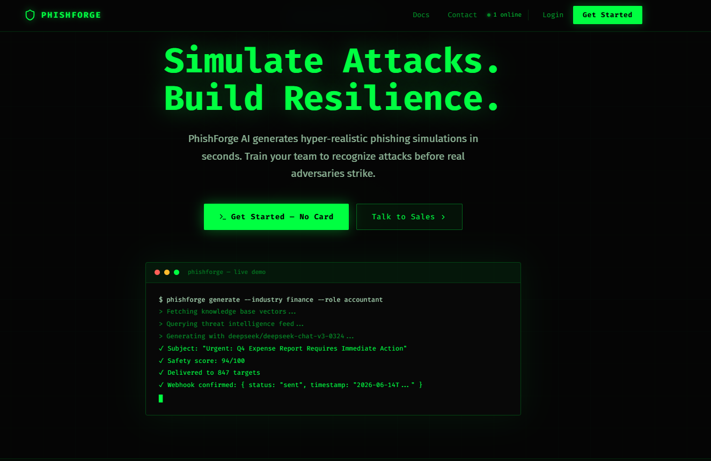

<p align="center">
  
</p>

<p align="center">
  
  
  
  
  
  
  
</p>

<h1 align="center">PhishForge</h1>

<p align="center">
  <strong>Enterprise-grade AI-powered phishing simulation & security awareness training platform.</strong><br />
  Built for security teams who want to train employees against real-world social engineering attacks.
</p>

<p align="center">
  <a href="https://phishforge-ai.vercel.app" target="_blank"><strong>🔗 Live Demo → phishforge-ai.vercel.app</strong></a>
</p>

<p align="center">
  <a href="#features">Features</a> &bull;
  <a href="#tech-stack">Tech Stack</a> &bull;
  <a href="#getting-started">Getting Started</a> &bull;
  <a href="#api-endpoints">API Endpoints</a> &bull;
  <a href="#deployment">Deployment</a>
</p>

---

## Features

- **AI Email Generation** — GPT-quality phishing emails tailored to target role, industry, and internal context via Retrieval-Augmented Generation (RAG)
- **Knowledge Base with Graph View** — Upload internal documents; PhishForge indexes them in Pinecone and surfaces related content visually
- **CyberBrain AI Assistant** — Contextual AI chat for security teams: threat briefings, campaign suggestions, and incident summaries
- **Interactive Training Labs** — Hands-on simulated phishing scenarios with real-time feedback loops for employees
- **Real-time Threat Intel** — Live threat-intelligence feeds surfaced inside the dashboard so campaigns stay current
- **Campaign Analytics** — Track open rates, click rates, report rates, and dwell time per campaign with exportable reports
- **Multi-tenant Architecture** — Full org isolation via Supabase Row-Level Security; each tenant gets a dedicated Pinecone namespace
- **GDPR Compliance** — Data minimization, right-to-forget endpoint, 90-day audit log rotation, and PII hashing throughout

---

## Tech Stack

| Layer | Technology |
|-------|-----------|
| **Frontend** | Next.js 15, TypeScript, Tailwind CSS, ShadCN UI |
| **Backend** | NestJS, Node.js 20, TypeScript |
| **AI** | OpenRouter (primary), DeepSeek, Llama (via Ollama) |
| **Database** | Supabase PostgreSQL with Row-Level Security |
| **Vector DB** | Pinecone — per-tenant RAG namespaces |
| **Auth** | Supabase Auth + JWT |
| **Billing** | Stripe Subscriptions |
| **Infra** | Docker, Turborepo monorepo |

---

## Getting Started

### Prerequisites

- Node.js 20+
- Docker & Docker Compose
- Supabase CLI — `npm i -g supabase`

### 1. Clone & Install

```bash
git clone https://github.com/pitchiluxe/phishforge.git
cd phishforge
npm install
```

### 2. Environment Setup

```bash
cp .env.local.example .env.local
```

Edit `.env.local` and populate the following variables:

| Variable | Purpose |
|----------|---------|
| `NEXT_PUBLIC_SUPABASE_URL` | Your Supabase project URL |
| `NEXT_PUBLIC_SUPABASE_ANON_KEY` | Supabase anon/public key |
| `SUPABASE_SERVICE_ROLE_KEY` | Server-side Supabase service role key |
| `OPENROUTER_API_KEY` | OpenRouter API key for AI generation |
| `PINECONE_API_KEY` | Pinecone API key for vector storage |
| `STRIPE_SECRET_KEY` | Stripe secret key for billing |
| `JWT_SECRET` | Secret for signing JWT tokens |

### 3. Database

```bash
supabase start
supabase db push
```

Or apply migrations manually:

```bash
psql $DATABASE_URL < infra/supabase/migrations/001_initial_schema.sql
```

### 4. Run in Development

```bash
npm run dev          # starts web (port 3000) + api (port 4000) via Turborepo
```

### 5. Full Stack with Docker

```bash
docker compose up --build
```

Services: `web` (3000), `api` (4000), `ollama` (11434), `redis` (6379)

---

## API Endpoints

| Method | Path | Description |
|--------|------|-------------|
| POST | `/api/v1/auth/register` | Register org + owner user |
| POST | `/api/v1/auth/login` | Login, returns JWT |
| POST | `/api/v1/campaigns` | Create campaign |
| POST | `/api/v1/campaigns/:id/generate` | AI-generate phishing content |
| POST | `/api/v1/validate` | Safety score (0–100) for generated content |
| GET | `/api/v1/stats` | Usage metrics per customer |
| GET | `/api/v1/ai/models/openrouter` | List available OpenRouter models |
| POST | `/api/v1/knowledge/upload` | Upload & index document into Pinecone |
| GET | `/api/v1/analytics/dashboard` | Dashboard stats |
| POST | `/api/v1/billing/checkout` | Create Stripe checkout session |
| POST | `/admin/delete-customer` | GDPR data purge (admin-only) |
| GET | `/admin/dsr` | Data subject access report |
| GET | `/t/:token` | Tracking pixel / click handler |

All routes except auth and tracking require `Authorization: Bearer <jwt>`.

---

## Project Structure

```
phishforge/
├── apps/
│   ├── web/          # Next.js 15 frontend (port 3000)
│   └── api/          # NestJS backend (port 4000)
├── packages/
│   └── shared/       # Shared TypeScript types & utilities
├── infra/
│   └── supabase/     # SQL migrations + RLS policies
├── docker-compose.yml
├── turbo.json
└── .env.local.example
```

---

## Screenshots

> **Campaign Dashboard** — Overview of active phishing campaigns with open/click/report metrics

> **AI Email Generator** — Craft role-specific phishing emails with RAG-enhanced personalization

> **Knowledge Base** — Graph view of uploaded documents and their semantic relationships

> **Analytics** — Per-campaign and org-level security awareness trend analysis

---

## Live Demo

**[https://phishforge-ai.vercel.app](https://phishforge-ai.vercel.app)** — Fully deployed on Vercel. Login with a demo account or connect your own Supabase project.

Self-host with Docker in minutes — see [Getting Started](#getting-started).

---

## Development Commands

```bash
npm run dev              # run all apps in watch mode
npm run build            # build all packages and apps
npm run lint             # lint all workspaces
npm run type-check       # TypeScript checks across all workspaces
npm run test             # run all test suites

# Per-workspace
npm run dev --workspace=apps/web
npm run dev --workspace=apps/api
```

---

## Multi-Tenancy & Security

Every resource is scoped to an `organization_id`. Supabase RLS policies enforce this at the database layer — no row is ever readable or writable across tenant boundaries. JWT tokens carry `{ sub, org_id, role }`.

Security controls:
- Rate limiting per API key (30 req/min for `/generate`, 60 req/min for `/validate`)
- Safety score gate — content scoring below 70 is flagged and blocked
- Audit trail on all sensitive operations with hashed identifiers
- Attachment content stored only as base64 in memory — never persisted to disk

---

## Compliance

- Audit logs on all sensitive operations (generation, logins, bulk actions)
- Safety scoring on all AI-generated content
- Campaign attribution metadata embedded in every generated artifact
- GDPR: data minimization, right-to-forget endpoint, 90-day log rotation
- SOC 2 / ISO 27001 controls mappable to audit log schema

---

## License

MIT License — see [LICENSE](LICENSE) for details.

---

<p align="center">Built with security awareness in mind. Use responsibly and only on authorized systems.</p>
